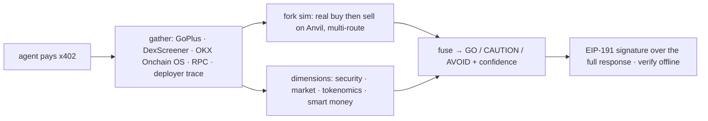

# Aletheia

**A verdict you can re-check, not a score you have to trust.**

One paid call before an agent acts: is this token, wallet, transaction or claim safe? Aletheia answers,
shows the evidence, and signs it — so the answer can be verified without trusting whoever gave it to you.


-black)


**Live:** [api.ivaronix.xyz](https://api.ivaronix.xyz) · **Proof — real outputs and on-chain settlement
hashes:** [/proof](https://api.ivaronix.xyz/proof) · **OKX.AI:** agent #9177
· **Product page:** [Notion](https://comfortable-goal-205.notion.site/Aletheia-39b9c0ce787681f2b05ac9cc07f82f56) · **All three:** [Hub](https://comfortable-goal-205.notion.site/OKX-AI-Genesis-Hackathon-Aletheia-Reach-Episteme-3a99c0ce78768104958be46465e840dd)

---

## Try it right now, without paying

Two endpoints are deliberately free so anyone can see the product before spending anything.

```bash
# A coarse verdict — no payment, no key
curl https://api.ivaronix.xyz/verdict/ethereum/0xdAC17F958D2ee523a2206206994597C13D831ec7

# The Evidence Court: two models argue prosecution vs defence over cited evidence, a jury rules
curl https://api.ivaronix.xyz/demo/courtroom/ethereum/0xdAC17F958D2ee523a2206206994597C13D831ec7
```

## The problem

A token can be safe to buy and impossible to sell.

Every security scanner reads the contract source and reasons about it. That catches clumsy scams. It does
not catch a contract that permits your buy and reverts your sell, because nothing in the code has to *say*
that — the logic can be a whitelist, a tax that only triggers above a size, or a check on who is calling.
Reading intent from code is guessing about behaviour, and an agent acting on that guess loses money
on-chain, irreversibly.

The usual remedy is a trust score, which asks you to trust the thing you were trying to verify.

## The idea

**Stop reading the contract. Run the trade.**

Aletheia forks mainnet at the live block, funds a throwaway account, buys the token, then tries to sell it
— across multiple DEX routers, multiple sizes and multiple origin addresses. A token counts as a honeypot
only if it is buyable but unsellable on *every* route, which is how the selective ones get caught: the
contracts that let a small sell through and block a real one. The provenance field says `MULTI_VECTOR`
only when a genuine round-trip actually completed; otherwise the service abstains rather than guessing.

Everything else follows from that decision. Facts come from seven independent sources, a multi-model jury
argues bull against bear until it converges, and the result is signed so a third party can check it.

## Paying for a call

No account, no key. Stablecoin transfers on X Layer are gas-free, so a call costs exactly its listed price.

```bash
# 1. Unpaid call → 402 with the challenge in the PAYMENT-REQUIRED header
curl -i -X POST https://api.ivaronix.xyz/verdict \
  -H 'Content-Type: application/json' -d '{}'

# 2. Sign the challenge (EIP-3009 authorization, USD₮0) and replay it
curl -X POST https://api.ivaronix.xyz/verdict \
  -H 'PAYMENT-SIGNATURE: <signed authorization>' \
  -H 'Content-Type: application/json' \
  -d '{"chain":"ethereum","address":"0xdAC17F958D2ee523a2206206994597C13D831ec7"}'
```

An **empty body on a paid endpoint returns that endpoint's input contract** with a worked example rather
than an error — you have already been charged by the time the handler runs, so you get something useful.

## What comes back

A real response, trimmed. Untrimmed examples for every service are on the
[proof page](https://api.ivaronix.xyz/proof).

```jsonc
{
  "verdict": "GO",
  "score": 88,
  "confidence": 0.533,
  "summary": "Owner can change the trading tax at will — current low tax can be raised to trap
              sellers after they buy. (Expected centralization for this established, CEX-listed
              token — not a rug indicator here.)",
  "dimensions": { "security": …, "market": …, "tokenomics": …, "smart_money": … },
  "signed": { "signer": "0x135Fe652d9657eD5b8A9BdB6Dfa5CDdfC639E738", "signature": "0x…" }
}
```

Note what the summary does: it reports a real centralization risk **and** says it is expected for this
asset. A service that only flags is noise; a service that only reassures is worthless. Established,
CEX-listed tokens read as known centralization rather than as a rug — which is why USDT returns GO here
instead of a false AVOID.

## Services

Sixteen paid services plus one A2A service negotiated over XMTP. Each quotes its exact price in the 402
challenge.

| Endpoint | What it answers | Price |
| --- | --- | ---: |
| `/verdict` | Is this token safe to trade? GO / CAUTION / AVOID | $0.02 |
| `/check` | One pre-action gate for anything — token, wallet, tx, URL or text | $0.03 |
| `/actionguard` | Does this content try to hijack my agent? | $0.01 |
| `/tx-report` | What will this transaction do to me before I sign it? | $0.02 |
| `/contract-audit` | Slither analysis, following proxies to the real implementation | $0.08 |
| `/watch/check` | What changed since the snapshot I stored? | $0.01 |
| `/dyor` | The full due-diligence checklist in one call, signed | $0.10 |
| `/research` | Deep research on any subject, every claim cited | $0.10 |
| `/ask` | One plain-language question, grounded and jury-checked | $0.05 |
| `/report` · `/wallet-report` · `/wallet-health` | Structured deep reports | $0.03–$0.05 |
| `/audit` | Live-probe another agent: injection resistance, accuracy, latency, cost | $0.05 |
| `/verify` | Have several models check another AI's output | $0.02 |
| `/settle` | A multi-round dispute ruling, sealed on-chain | $0.03 |
| `/kol` | Is this X account a credible voice or a paid shill? | $0.02 |

There is also an **MCP server** (`src/mcp/server.ts`), so any agent framework — Claude Code, Codex,
OpenClaw — can call these tools natively.

## How it is built



Payment verifies and settles in middleware, before any handler runs. Three decisions worth calling out,
each of which came from something going wrong in testing:

- **The receipt covers the whole answer.** It once signed the first 700 characters of a response. On a
  946-character answer that left the final quarter — including the recommendation itself — unattested, and
  the cut landed mid-URL. A signature over a prefix is worse than none, because it looks like proof.
- **A missing feed is never a bad grade.** When market data is empty the liquidity dimension returns no
  judgement rather than `BAD`. A gap in our data is not a finding about the asset.
- **One model cannot take an endpoint down.** Inference walks an ordered chain; when a model is
  unavailable the next serves, and the response names the model that actually ran.

## Verify a result yourself

```bash
# The published signing address — compare it to the signer you recover
curl https://api.ivaronix.xyz/.well-known/aletheia-signer

# Or post a signed object back and have it checked
curl -X POST https://api.ivaronix.xyz/receipt/verify \
  -H 'Content-Type: application/json' -d '{"signed": { … }}'
```

Alter one field of the response and verification fails. That is the entire point.

## What it does not do

- **A clean verdict is not a guarantee.** It means the checks that ran found nothing, and the response
  names which checks ran. Coverage varies by chain.
- **The simulation needs liquidity.** With no pool to fill against it falls back to a static read and
  labels itself as such rather than pretending.
- **It is not financial advice.** It is evidence, assembled and signed.

An honest benchmark — sample size, precision, recall and limitations — is published in
[`data/scoreboard.md`](data/scoreboard.md).

## Development

```bash
npm install
cp .env.example .env      # see SETUP.md for where each key comes from
npm test                  # 128 deterministic unit tests
npm run typecheck         # tsc --noEmit
npm start                 # tsx src/api/server.ts
```

The service **refuses to start** if x402 is only half-configured, rather than serving paid routes for
free. `ALETHEIA_DEV_OPEN=1` is the explicit local-development escape hatch and must never be set in
production.

## Layout

`src/adapters` (evidence sources) · `src/sim` (fork buy/sell simulation) · `src/engine` (dimensions,
fusion, verdict, courtroom, reports) · `src/ai` (model router with fallback chain) · `src/api` + `src/mcp`
(surfaces) · `src/net` (SSRF-guarded fetch) · `src/attest` (signing). See `ARCHITECTURE.md`.

MIT licensed. Informational only — not financial advice.
